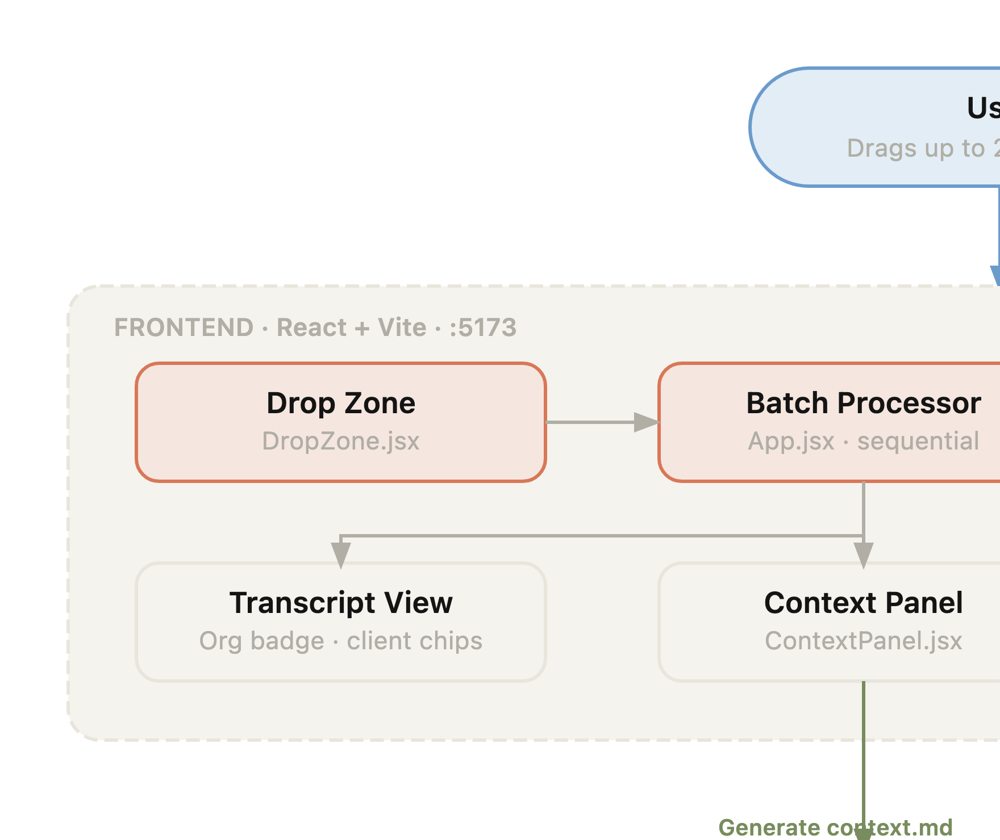

# Shower Thoughts

> Built in an afternoon with Claude for less than $0.50 in AI tokens. Because why pay $20/month?

## The Story

I keep an old school voice recorder on me — a dedicated device — because my iPhone is usually tied up playing podcasts. Ideas and work thoughts pile up as a folder of unnamed MP3s with no structure.

I looked at transcription services. Most charge $10–20/month. Some cap your minutes. All of them want a subscription for something I'd use a few times a week.

So I asked Claude to build it instead.

**Total cost to build this entire app:** ~$0.27 in Claude API tokens (roughly 42,000 tokens on Claude Sonnet at $3/1M input, $15/1M output).

**Cost per transcription once built:** ~$0.03–0.05 per 5-minute recording (OpenAI Whisper at $0.006/min + a few GPT-4o-mini tokens to organize it).

At that rate I'd have to transcribe **400+ recordings** before I'd break even with a single month of a subscription service. And I own the code.

---

Drop up to 20 MP3/WAV/M4A recordings. Each file is transcribed via OpenAI Whisper, then structured by GPT-4o-mini into sections grouped by organization and client. When done, generate and download a single `context.md` file containing everything.

---

## How It Works



---

## Stack

| Layer | Tech |
|---|---|
| Frontend | React 18 + Vite (port 5173) |
| Backend | Node.js + Express (port 3001) |
| Transcription | OpenAI Whisper API (`whisper-1`) |
| Organization | OpenAI Chat API (`gpt-4o-mini`) |
| File upload | Multer (multipart/form-data) |

---

## Getting Started

### 1. Install dependencies

```bash
# Backend
cd backend && npm install

# Frontend
cd frontend && npm install
```

### 2. Set your OpenAI API key

```bash
cd backend
cp .env.example .env
# Edit .env and add: OPENAI_API_KEY=sk-...
```

### 3. Run

```bash
# Terminal 1 — backend
cd backend && npm run dev

# Terminal 2 — frontend
cd frontend && npm run dev
```

Open **http://localhost:5173**

---

## Usage

1. Drag up to **20 audio files** (MP3, WAV, M4A) into the drop zone
2. Click **Transcribe Recordings**
3. Each file is processed sequentially — results appear inline as they finish
4. Click **📄 Generate context.md** to download a structured markdown file grouped by organization and client

---

## Project Structure

```
transcription-app/
├── backend/
│   ├── server.js        # Express server, /api/transcribe endpoint
│   ├── transcribe.js    # Whisper + GPT-4o-mini pipeline
│   ├── .env.example
│   └── package.json
└── frontend/
    ├── src/
    │   ├── App.jsx                    # Main app, batch processing logic
    │   ├── components/
    │   │   ├── DropZone.jsx           # Drag-and-drop file input (up to 20)
    │   │   ├── TranscriptView.jsx     # Per-file result with org badge
    │   │   └── ContextPanel.jsx       # Generates + downloads context.md
    │   └── App.css
    ├── vite.config.js   # Proxies /api → localhost:3001
    └── package.json
```

---

## API

### `POST /api/transcribe`

- **Body:** `multipart/form-data` with an `audio` field
- **Response:**
  ```json
  {
    "transcript": "...",
    "organization": "...",
    "clients": ["Client A", "Client B"]
  }
  ```

## Environment Variables

| Variable | Description |
|---|---|
| `OPENAI_API_KEY` | Your OpenAI API key (required) |
| `PORT` | Backend port (default: 3001) |
